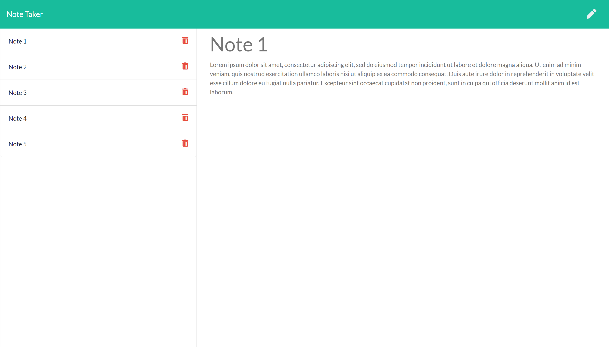

# Note Taker

# [Live site deployed on heroku](https://noterator.herokuapp.com/)

## Description

---

This is a website where you can save and delete your daily notes, so you can organize your toughts and keep track of tasks to be completed.

## Table of Contents

- [Installation](#installation)
- [Usage](#usage)
- [Contributing](#contributing)
- [Tests](#tests)
- [License](#license)

## Installation

_To install this application, make sure you clone the repo to your device. Install node and express. Run npm init. Run npm install. Run npm install express. Run npm install uniqid._

## npm install

## Usage

_open website [https://noterator.herokuapp.com](https://noterator.herokuapp.com) and click on Get Started. When main page opens you will be presented with your saved notes and you can add and delete notes_

## Tests

_Tests for application and how to run them:_

## No tests available

## License

## 

## Questions?

For any questions, please contact me with the information below:

## Contact me:    

